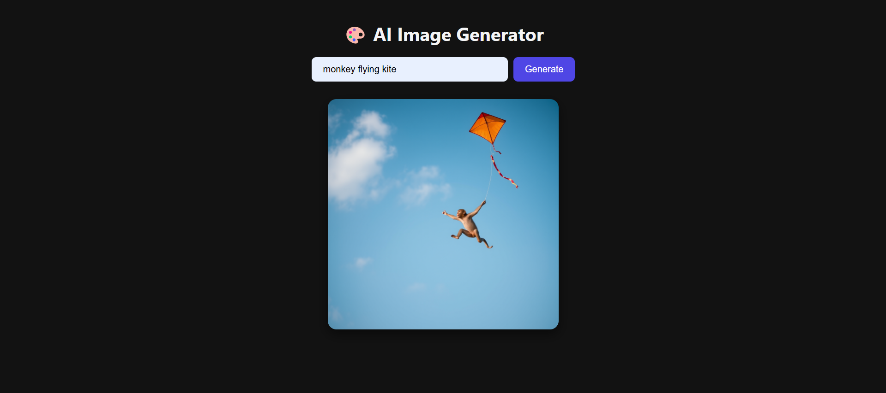

# 🎨 AI Image Generator

A simple and beautiful PHP-based AI Image Generator using **Nebius Studio Image API**.  
This project allows users to enter a prompt and generate an AI-created image in real-time.



---

## 🚀 Features

- Prompt-based image generation
- Clean & modern UI
- Responsive design
- Loader animation while generating image
- Smooth image display
- No external libraries used (Pure PHP, HTML, CSS, JavaScript)

---

## 🛠️ Tech Stack

- **Frontend:** HTML, CSS, JavaScript
- **Backend:** PHP (cURL)
- **API:** [Nebius Studio Image Generation API](https://api.studio.nebius.com)

---

## 📂 Project Structure

project/ ├── index.php → Main frontend + backend code ├── screenshot.png → UI preview (optional) └── README.md → Project documentation


---

## 🔑 Requirements

- PHP 7+ or higher
- A valid **Nebius Studio API Key**  
  👉 Get API Key: [https://api.studio.nebius.com](https://api.studio.nebius.com)

---

## ⚙️ Installation & Usage

1. **Clone the repository**

```bash
git clone https://github.com/yourusername/ai-image-generator.git
cd ai-image-generator


